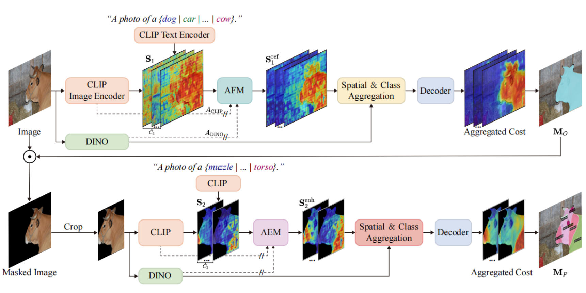

# HOPS: Hierarchical Open-vocabulary Part Segmentation with Attention-Aware Filtering and Affinity-Guided Enhancement


<br/>

### Installation


```sh
# ------------------
#     Init conda
# ------------------
conda create --name hops python=3.8 -y
conda activate hops
pip install --upgrade pip
conda install cuda=12.4.1 -c nvidia -y
pip install torch==2.2.2 torchvision==0.17.2 --index-url https://download.pytorch.org/whl/cu121
pip install timm==0.9.1
pip install scikit-image==0.21.0
pip install scikit-learn==0.24.2
pip install opencv-python==4.5.5.64
pip install hydra-core==1.3.2
pip install openmim==0.3.6
pip install mmsegmentation==0.29.1
pip install tokenizers==0.11.1
pip install Pillow~=9.5
pip install numpy==1.23.0
pip install einops ftfy regex fire ninja psutil gdown

# --------------------------
#     Install Detectron2
# --------------------------
pip install 'git+https://github.com/facebookresearch/detectron2.git'
python -c "import detectron2; print(detectron2.__version__)"  # 0.6

# --------------------------
#     Install mmcv
# --------------------------
# pip install mmcv-full==1.7.1
# => if an error occurs
pip install mmcv-full==1.7.1 -f https://download.openmmlab.com/mmcv/dist/cu110/torch1.7.0/index.html
python -c "import mmcv; print(mmcv.__version__)"  # 1.7.1
```
<br/>

### Prepare Datasets

```sh
cd datasets
```

#### PascalPart116

* You can find further information in the [OV-PARTS](https://github.com/OpenRobotLab/OV_PARTS) GitHub repository.

```sh
gdown https://drive.google.com/uc?id=1QF0BglrcC0teKqx15vP8qJNakGgCWaEH
tar -xzf PascalPart116.tar.gz
find ./PascalPart116/images/val/ -name '._*' -delete
find ./PascalPart116/ -name '._*' -delete
```


#### ADE20KPart234

```sh
gdown https://drive.google.com/uc?id=1EBVPW_tqzBOQ_DC6yLcouyxR7WrctRKi
tar -xzf ADE20KPart234.tar.gz
```

#### PartImageNet

* Download the `LOC_synset_mapping.txt` file from [this link](https://www.kaggle.com/c/imagenet-object-localization-challenge/data) and place it in the `datasets` folder.
* Download `PartImageNet_Seg` from [PartImageNet](https://github.com/TACJu/PartImageNet) and extract it into the `datasets` folder as `PartImageNet`

<br/>

### Preprocess Datasets

- PascalPart116
- ADE20KPart234
- PartImageNet

```sh
# PascalPart116
python baselines/data/datasets/mask_cls_collect.py \
    datasets/PascalPart116/annotations_detectron2_part/val \
    datasets/PascalPart116/annotations_detectron2_part/val_part_label_count.json

python baselines/data/datasets/mask_cls_collect.py \
    datasets/PascalPart116/annotations_detectron2_obj/val \
    datasets/PascalPart116/annotations_detectron2_part/val_obj_label_count.json

# ADE20KPart234
# (no preprocessing required)

# PartImageNet
cd datasets
python partimagenet_preprocess.py --data_dir PartImageNet
# Make sure to have LOC_synset_mapping.txt in the datasets folder mentioned above.

<br/>

Make sure to place the downloaded weights in the `pretrain_weights` folder.

```bash
mkdir pretrain_weights && cd pretrain_weights
# CAT-Seg
wget https://huggingface.co/hamacojr/CAT-Seg/resolve/main/model_final_base.pth
cd ..
```

<br/>

### Usage (Run)

##### Zero-Shot Prediction

```sh
# -------------
#     Train
# -------------
python train_net.py \
    --num-gpus 1 \
    --config-file configs/zero_shot/hops_partimagenet.yaml

# -----------------
#     Inference
# -----------------
python train_net.py \
    --num-gpus 1 \
    --config-file configs/zero_shot/hops_partimagenet.yaml \
    --eval-only MODEL.WEIGHTS ./weights/hops_partimagenet.pth
```

<br/>

### Acknowledgement

We would like to express our gratitude to the open-source projects and their contributors, including [PartCATSeg](https://github.com/kaist-cvml/part-catseg), [PartCLIPSeg](https://github.com/kaist-cvml/part-clipseg), [OV-PARTS](https://github.com/OpenRobotLab/OV_PARTS), [CLIPSeg](https://github.com/timojl/clipseg), [Mask2Former](https://github.com/facebookresearch/Mask2Former), [CLIP](https://github.com/openai/CLIP), and [OV-DETR](https://github.com/yuhangzang/OV-DETR).
